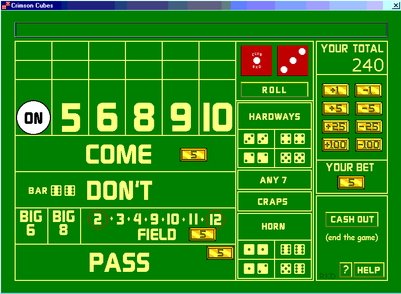



## Crimson Cubes

### Description

Crimson Cubes is a casino Craps simulation. My hope is that, even though there are a lot of concepts, from random numbers for the dice to generating controls on the fly for the bets to dragging and dropping those bets and more, beginners will be able to go through the code and understand how it works. To that end, I tried to keep the project simple - just a couple forms a few modules and comments that explain not only what the code is doing but why it is doing it. I also tried to throw in my two cents worth about good coding practices. If nothing else, I hope you enjoy playing the game.
 
### More Info
 

             |
---                |---
**Submitted On**   |2002-06-14 23:37:02
**By**             |[Robert D](https://github.com/Planet-Source-Code/PSCIndex/blob/master/ByAuthor/robert-d.md)
**Level**          |Beginner
**User Rating**    |5.0 (15 globes from 3 users)
**Compatibility**  |VB 6\.0
**Category**       |[Games](https://github.com/Planet-Source-Code/PSCIndex/blob/master/ByCategory/games__1-38.md)
**World**          |[Visual Basic](https://github.com/Planet-Source-Code/PSCIndex/blob/master/ByWorld/visual-basic.md)
**Archive File**   |[Crimson\_Cu978046232002\.zip](https://github.com/Planet-Source-Code/robert-d-crimson-cubes__1-36183/archive/master.zip)

